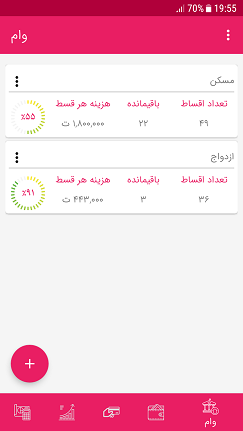

# Financial Management Android App (Android Java)

This is an Android application developed using Java that allows users to manage their financial transactions, accounts, loans, and more.

## Table of Contents

- [Overview](#overview)
- [Installation](#installation)
- [Features](#features)
- [Screenshots](#screenshots)
- [Technologies Used](#technologies-used)
- [License](#license)

## Overview

This Android Java application provides users with a platform to efficiently manage their finances. It offers features such as adding and categorizing transactions, tracking accounts, managing loans, and more.

## Installation

To run this application on your local device, follow these steps:

1. Clone the repository: `git clone https://github.com/Miladkiani/financial-management-androind-java.git`
2. Open the project in Android Studio.
3. Build and run the app on an Android emulator or physical device.

## Features

- Add, categorize, and track financial transactions
- Manage multiple accounts and their balances
- Keep track of loans and repayments
- Generate reports for expense analysis
- User-friendly interface for seamless financial management

## Screenshots

## Technologies Used

- Java programming language
- Android Studio IDE
- Android components (e.g., Activities, Fragments, Intents)

## License

This project is licensed under the [MIT License](LICENSE).
